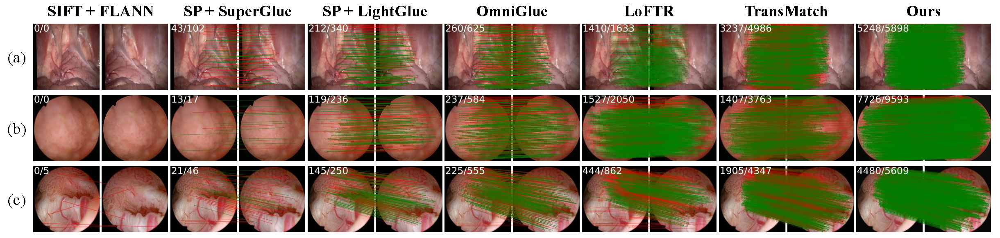

# EndoMatcher

This repository provides the code for the paper:  
**"EndoMatcher: Generalizable Endoscopic Image Matching via Large-Scale Multi-Domain Pretraining"**.

> EndoMatcher is a generalizable dense feature matcher tailored for endoscopic images, enabling robust performance under difficult visual conditions such as weak textures, illumination variation, and large camera motion.  
> It is trained on **Endo-Mix6**, the first large-scale multi-domain endoscopic matching dataset (1.2M image pairs).  
> Our method achieves state-of-the-art results in **zero-shot** matching across multiple datasets.



---

## 📊 Zero-Shot Matching Performance

### Hamlyn & Bladder Tissue Datasets

| Method | Training Sets | N<sub>pt</sub> | N<sub>inlier</sub> | KR | N<sub>pt</sub> | N<sub>inlier</sub> | KR | FPS ↑ |
|--------|----------------|------------------------|--------------------|--------|---------------------------|--------------------|--------|-------|
| SIFT + FLANN | - | 5.97 | 4.15 | 28.67 | 18.34 | 13.52 | 50.23 | - |
| SuperPoint + SuperGlue | COCO + ScanNet | 47.80 | 30.85 | 60.74 | 36.75 | 26.31 | 61.77 | 6.11 |
| SuperPoint + LightGlue | COCO + MegaDepth | 230.39 | 168.60 | 69.45 | 312.83 | 223.37 | 67.18 | 8.91 |
| OmniGlue | MegaDepth | 588.38 | 225.34 | 37.49 | 616.57 | 265.19 | 41.74 | 0.57 |
| LoFTR | ScanNet | 1847.44 | 1486.84 | _**72.26**_ | 1845.64 | 1382.48 | _**68.19**_ | _**12.83**_ |
| TransMatch | MegaDepth | _**4676.61**_ | _**2648.92**_ | 55.25 | _**4557.93**_ | _**2029.05**_ | 43.84 | 0.02 |
| **Ours** | Endo-Mix6 | **8190.21** | **6375.70** | **73.40** | **8346.82** | **6116.20** | **68.75** | **47.38** |

---

### Gastro-Matching Dataset

| Method | HEA@3px ↑ | HEA@5px ↑ | MDPA ↑ |
|--------|-----------|-----------|--------|
| SIFT + FLANN | 42.0 | 57.1 | 1.1 |
| SuperPoint + SuperGlue | 78.0 | 88.1 | 59.6 |
| SuperPoint + LightGlue | 75.3 | 86.0 | 57.6 |
| OmniGlue | 70.4 | 82.5 | 52.8 |
| LoFTR | 71.8 | 83.9 | 53.8 |
| TransMatch | _**85.1**_ | _**93.3**_ | _**76.0**_ |
| **Ours** | **88.7** | **95.8** | **85.4** |

---

## 📁 Dataset: Endo-Mix6

We build **Endo-Mix6**, a large-scale **multi-domain** dataset for endoscopic image matching with:
- 1.2 million image pairs
- Across 6 diverse real and synthetic domains
- Correspondence labels from SfM and simulation
- Diverse motion, lighting, and organ types

**Download links for Endo-Mix6 will be provided soon.**

---

## 🧪 Demo: Run Matching on Your Data

To run matching on endoscopic image sequences:

### 1. Install Environment

```bash
git clone https://github.com/YourRepo/EndoMatcher.git
cd EndoMatcher
pip install -r requirements.txt
```

### 2. Download Pretrained Model

[📥 Pretrained EndoMatcher Model (OneDrive)](https://1drv.ms/u/c/3e70577908ec5d62/EbItrz8y1mdKjvnCI9UfeH4BO_z2DC59y1UlcCwEfjmq1Q?e=rtrrkh)

Place the model file inside a folder named `checkpoint`.

### 3. Run the Demo

```bash
python demo.py --config config.yaml
```

- This will run dense matching on image sequences in `Demo_seqs/images`.

---

## ⚙️ Configuration

Edit `config.yaml` to modify matching parameters such as:

```yaml
max_feature_detection: 10000
octave_layers: 8
contrast_threshold: 5e-5
edge_threshold: 100
sigma: 1.1
...
```

---

## 📚 Citation

If you find this work useful, please cite our paper:

```bibtex
@article{your2025endomatcher,
  title={EndoMatcher: Generalizable Endoscopic Image Matching via Large-Scale Multi-Domain Pretraining},
  author={Your Name and Others},
  journal={arXiv preprint},
  year={2025}
}
```

---

## 🙏 Acknowledgements

This code is built upon:
- [DenseDescriptorLearning](https://github.com/lppllppl920/DenseDescriptorLearning-Pytorch)
- [DPT (Dense Prediction Transformers)](https://github.com/intel-isl/DPT)

We thank the authors for their excellent work.

---

## 🔮 Future Updates

- [ ] Endo-Mix6 dataset release
- [ ] Training code and scripts
- [ ] Extended evaluation benchmarks

For any questions, feel free to open an issue or contact us.
